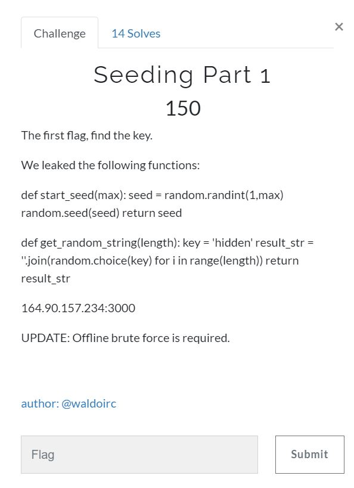

# Seeding part 1
**

This challenge starts with a couple 'leaked' python functions and we are tasked with finding the key.

So first off lets look at the code we are given

    def start_seed(max):
     seed = random.randint(1,max)
     random.seed(seed)
     return seed
    
    def get_random_string(length):
     key = 'hidden'
     result_str = ''.join(random.choice(key) for i in range(length))
     return result_str

We have 2 functions `start_seed` and `get_random_string`

When we connect to IP address given using netcat we get a response like this

    $ nc 164.90.157.234 3000
    The seed is a number that can be from anywhere between 1 to 100.
    The seed this run was: 2
    The fourth iteration of this key is: vlmvdmioiddevvea
    
    The first flag is the key.  What is the key?:

With the code and the response we get from netcat we can start putting the pieces together for exactly what we are trying to solve.

When we look at the get_random_string function we see it has a key of 'hidden' (which is not the correct key because that would be far too easy). But the problem we are trying to solve is what is the key being used in their code to generate the output we are seeing when we connect.  The response says 'The fourth iteration of this key is...' so that tells us that they are running the `get_random_string` function 4 times before outputting.  

If we run our netcat command from above a few times we can get a sampling of the characters key is made up of, they are `adeilmorsv`

The question is in what order and how many.  You can brute force just the 10 characters pretty easily as there are only about 3.6 million possible orderings, but once you realize it's longer the question is how long and the number of possible keys gets impractically huge.  For example if we have a single repeated characters that 3.6 million becomes 399 million!  It will grow by a factor of roughly 110 for every character you add.  So unless we have unlimited time and patience this is not the way to solve this problem.

We should look closer at the code, the key line in `get_random_string` is
 `result_str = ''.join(random.choice(key) for i in range(length))`  
 We need to understand exactly how this works.  It is using the `random.choice` function to select a random character from the key and doing it length times...by looking at the output when we connect we know that length must be 16...since all the outputs it gives us are 16 characters long.

The key realization of this puzzle IMO is that for any given key length and seed value the output will be scrambled in exactly the same way every time.

so if we set key to be '0123456789' and give a seed of 2 we get this output: '5955726783747885' since every character in our key is unique we can see exactly how the characters are scrambled by random.choice

Obviously I only showed a small mapping of the scrambling, but the idea is apparent, there is one important observation we should make. Since we are scrambling the characters randomly some characters from the key will not appear in the output at all, for example in this example the first and second characters of the key '0' and '1' do not appear in the output, this also should have been apparent from the fact that in order to get all 10 characters of the key we had to run the program multiple times. 

If we can determine the scrambling for a key length of 10 and we've seen that any key will be scrambled in a consistent want as long as the key length and key are set, we can do it for any key length.

How does this help?
Well lets compare the output we got from our test and the output given by the code

    5955726783747885
    vlmvdmioiddevvea
   According to the string we generated the 1st, 3rd, 4th and last characters of the output should all be the same character.  In the output given by the program these characters are v,m,v,and a.  This proves that the key cannot be the correct key length.
   
 We could certainly write code to go through different key lengths and do this comparison manually and that's a perfectly reasonable way to solve this problem.  Personally, I tried this and mixed up my character comparisons so went right past the correct solution, I ended up writing some more elaborate code that generated the string and matched them with the output given by the program and attempted to do the mapping and detect mismatches programmatically.

First here is some code that you could use to generate outputs based on a set of seeds and try to map them to the observed outputs by hand

    import random
    
    def get_rand_str(key,length):
        rtn = ''.join(random.choice(key) for i in range(length))
        return rtn
    
    base_str = '0123456789ABCDEFGHIJKLMNOPQRSTUVWXYZ'
    seed_list = [2,20,48,66,69]
    key_sz_list = list(range(10,20))
    
    for s in seed_list:
        print( 'seed is '+str(s) )
        for key_sz in key_sz_list:
            key = base_str[0:key_sz]
            a = ''
            random.seed(s)
            for i in range(4):
                a = get_rand_str(key,16)
            print( str(key_sz) + ':  ' + str(a) )

Here is the final program I used to generate outputs for various seeds and attempt to map them to the seed/output combinations I observed in the program

    import random
    
    seed_list = [2,20,48,66,69]
    seed_dict = { 2 : 'vlmvdmioiddevvea', 20 : 'edveoaillmseiems', 48 : 'esrrissmediadise', 66 : 'eiirmasidieealed', 69 : 'oadiroesrmoeiiao' }
    base_str = '0123456789ABCDEFGHIJKLMNOPQRSTUVWXYZ'
    key_sz_list = list(range(10,20))
    
    def get_rand_str(key,length):
        rtn = ''.join(random.choice(key) for i in range(length))
        return rtn
    
    def find_occurrences(s, ch):
            return [i for i, letter in enumerate(s) if letter == ch]
    
    def try_match(seed, try_str, key_sz ):
        match_str = seed_dict[seed]
        #note random_str will be the same length as the match_str, 16
        uniq_chars = set(try_str)
        this_try = ''.join('*'*key_sz)
        for a in uniq_chars:
            index_list = find_occurrences( try_str, a )
            prev = '*'
            for b in index_list:
                p = base_str.find(a)
                this_try = this_try[0:p]+match_str[b]+this_try[p+1:]
    
                if prev != match_str[b] and prev != '*':
                    #mismatch
                    return 'fail'
                prev = match_str[b]
        print( 'no mismatches for seed '+str(seed)+' with key length '+str(key_sz)+'.\n'+str(try_str)+' -> \n'+str(this_try)+'  =~ \n'+str(match_str)+'\n' )
        return 'success '+str(this_try)
    
    
    for s in seed_list:
        for key_sz in key_sz_list:
            key = base_str[0:key_sz]
            a = ''
            random.seed(s)
            for i in range(4):
                a = get_rand_str(key,16)
            try_match(s, a, key_sz)

This program generates the following output:

    $ python ./output_matching.py
    no mismatches for seed 2 with key length 18.
    E5CEG7F8FGGBEEBH ->
    *****l*mo**em*vida  =~
    vlmvdmioiddevvea
    
    no mismatches for seed 20 with key length 18.
    4AE48HD55C34DB73 ->
    ***sel*mo*demiv**a  =~
    edveoaillmseiems
    
    no mismatches for seed 48 with key length 18.
    B399F3374AFHAD30 ->
    e**se**m*rde*i*i*a  =~
    esrrissmediadise
    
    no mismatches for seed 66 with key length 18.
    BFD1CH3DAFBB650A ->
    er*s*la***demi*i*a  =~
    eiirmasidieealed
    
    no mismatches for seed 69 with key length 18.
    8HGD18239C84FF68 ->
    *rese*a*or**mi*ida  =~
    oadiroesrmoeiiao

It appears the only output strings that didn't generate a mismatch are of length 18, well that certainly makes it easy!

If we line up all the strings where we mapped the key characters to the output for the various keys we get this:

    *****l*mo**em*vida
    ***sel*mo*demiv**a
    e**se**m*rde*i*i*a
    er*s*la***demi*i*a
    *rese*a*or**mi*ida

Which lets you fill in the blanks fairly easily
So the key used by the program is `ereselamordemivida`

If we put that into the program we get this response:

> Written with [StackEdit](https://stackedit.io/).

